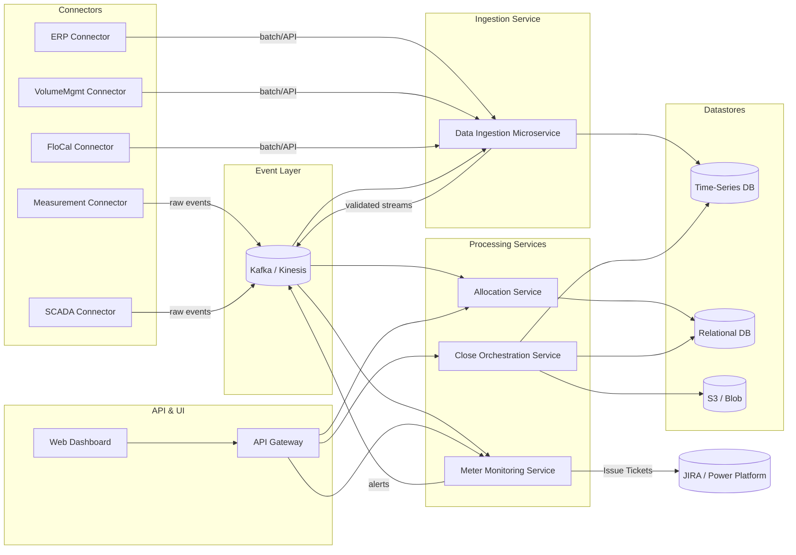

2nd# System Architecture for AutoClose Prototype

This document outlines the high-level architecture of the midstream Monthly Measurement Close ("AutoClose") prototype, following the MACH Alliance principles.

## 1. MACH Principles
- **Microservices**: Small, single-purpose services for ingestion, monitoring, allocation, and close orchestration.
- **API-first**: All services expose RESTful or gRPC APIs with OpenAPI specifications.
- **Cloud-native**: Containerized services running on Kubernetes (e.g., AWS EKS) with managed infrastructure.
- **Headless**: Decoupled UI; front-end (web dashboard) consumes headless APIs.

## 2. Component Diagram

## 3. Tech Stack

| Layer               | Technology Options                                         |
|---------------------|-------------------------------------------------------------|
| Container Platform  | Docker, Kubernetes (AWS EKS / GKE / AKS)                     |
| Service Mesh & API  | Istio / Linkerd; Kong / AWS API Gateway                     |
| Messaging           | Apache Kafka or AWS Kinesis                                 |
| Compute             | Node.js (TypeScript) or Python (FastAPI) microservices       |
| Databases           | InfluxDB / TimescaleDB for time-series; PostgreSQL for relational |
| Storage             | AWS S3 (or MinIO) for reports & bulk data                   |
| CI/CD               | GitHub Actions / GitLab CI; Helm charts & Argo CD           |
| Monitoring & Logs   | Prometheus, Grafana, ELK stack                              |
| Security            | OAuth2 / OpenID Connect; TLS everywhere; Vault for secrets   |

## 4. Next Steps
1. Configure CI/CD pipelines (GitHub Actions + Argo CD) and container registry.
2. Scaffold microservices repo structure and OpenAPI specs.
3. Provision Kubernetes cluster and message bus.
4. Begin implementing Connector Microservice scaffold.
